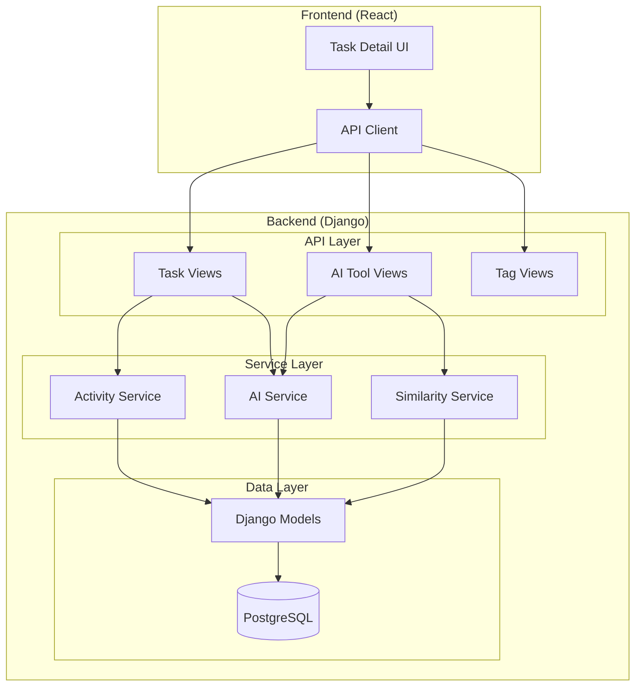

# Design Document

## Overview

The AI Tools for Task System extends a Django-based task management system with three AI-powered tools: Smart Summary, Smart Estimate, and Smart Rewrite. The system uses a monorepo structure with Django REST Framework for the backend API and React for the frontend. All AI responses are deterministic and mocked, with no external LLM calls required.

The architecture follows Django best practices with models, serializers, views, and services. Activity logging is implemented through Django signals to ensure consistency. The similarity algorithm for estimates uses rule-based matching on assignee, tags, and text content.

## Architecture

### System Architecture



### Technology Stack

- **Backend**: Django 4.2+ with Django REST Framework
- **Database**: PostgreSQL with appropriate indexes
- **Frontend**: React with TypeScript, Axios for API calls
- **Authentication**: Django's built-in authentication system
- **Serialization**: DRF serializers for JSON contracts

## Components and Interfaces

### Django Models

#### Task Model
```python
class Task(models.Model):
    id = models.UUIDField(primary_key=True, default=uuid.uuid4)
    title = models.CharField(max_length=200)
    description = models.TextField(blank=True)
    status = models.CharField(max_length=20, choices=STATUS_CHOICES)
    estimate = models.PositiveIntegerField(null=True, blank=True)
    assignee = models.ForeignKey(User, null=True, blank=True, related_name='assigned_tasks')
    reporter = models.ForeignKey(User, null=True, blank=True, related_name='reported_tasks')
    tags = models.ManyToManyField('Tag', blank=True)
    created_at = models.DateTimeField(auto_now_add=True)
    updated_at = models.DateTimeField(auto_now=True)
```

#### TaskActivity Model
```python
class TaskActivity(models.Model):
    task = models.ForeignKey(Task, related_name='activities')
    actor = models.ForeignKey(User, null=True, blank=True)
    type = models.CharField(max_length=30, choices=ACTIVITY_TYPE_CHOICES)
    field = models.CharField(max_length=50, blank=True)
    before = models.JSONField(null=True, blank=True)
    after = models.JSONField(null=True, blank=True)
    created_at = models.DateTimeField(auto_now_add=True)
```

#### Tag Model
```python
class Tag(models.Model):
    name = models.CharField(max_length=64, unique=True)
    
    class Meta:
        constraints = [
            models.UniqueConstraint(
                Lower('name'), 
                name='unique_tag_name_case_insensitive'
            )
        ]
```

### API Views Structure

#### Task ViewSet
- Handles CRUD operations with filtering and pagination
- Integrates with activity logging through signals
- Supports query parameters: status, assignee, tag, page, page_size

#### AI Tool Views
- **SmartSummaryView**: Returns mocked lifecycle summary
- **SmartEstimateView**: Uses SimilarityService for estimate calculation
- **SmartRewriteView**: Returns enhanced task description

#### Tag ViewSet
- Simple CRUD for tag management
- Enforces case-insensitive uniqueness

### Service Layer

#### AIService
```python
class AIService:
    @staticmethod
    def generate_summary(task: Task) -> str:
        # Deterministic mocked summary based on task activities
        
    @staticmethod
    def generate_rewrite(task: Task) -> dict:
        # Deterministic user story generation
```

#### SimilarityService
```python
class SimilarityService:
    @staticmethod
    def find_similar_tasks(task: Task, limit: int = 20) -> QuerySet:
        # Rule-based similarity matching
        
    @staticmethod
    def calculate_estimate_suggestion(similar_tasks: QuerySet) -> dict:
        # Median calculation with confidence scoring
```

#### ActivityService
```python
class ActivityService:
    @staticmethod
    def log_task_creation(task: Task, actor: User):
        # Create CREATED activity
        
    @staticmethod
    def log_field_changes(task: Task, changes: dict, actor: User):
        # Create activities for each changed tracked field
```

## Data Models

### Task Status Enum
```python
class TaskStatus(models.TextChoices):
    TODO = 'TODO', 'To Do'
    IN_PROGRESS = 'IN_PROGRESS', 'In Progress'
    BLOCKED = 'BLOCKED', 'Blocked'
    DONE = 'DONE', 'Done'
```

### Activity Type Enum
```python
class ActivityType(models.TextChoices):
    CREATED = 'CREATED', 'Created'
    UPDATED_STATUS = 'UPDATED_STATUS', 'Status Updated'
    UPDATED_ASSIGNEE = 'UPDATED_ASSIGNEE', 'Assignee Updated'
    UPDATED_ESTIMATE = 'UPDATED_ESTIMATE', 'Estimate Updated'
    UPDATED_DESCRIPTION = 'UPDATED_DESCRIPTION', 'Description Updated'
    DELETED = 'DELETED', 'Deleted'
```

### Similarity Algorithm

The similarity matching follows this priority order:

1. **Same Assignee**: Tasks assigned to the same user
2. **Overlapping Tags**: Tasks sharing at least one tag
3. **Title Substring**: First 20 chars of current task title found in candidate title (case-insensitive)
4. **Description Substring**: First 40 chars of current task description found in candidate description (case-insensitive)

Results are sorted by `updated_at` descending, limited to top 20 candidates for estimate calculation, with up to 5 task IDs returned in the response.

### Database Indexes

```sql
-- Performance indexes
CREATE INDEX idx_task_status ON tasks_task(status);
CREATE INDEX idx_task_assignee ON tasks_task(assignee_id);
CREATE INDEX idx_task_updated_at ON tasks_task(updated_at DESC);
CREATE INDEX idx_activity_task_created ON tasks_taskactivity(task_id, created_at);
```

## Error Handling

### Validation Strategy
- Use DRF serializers for input validation
- Custom validators for business rules (e.g., estimate ≥ 0)
- Model-level constraints for data integrity

### Error Response Format
```json
{
    "detail": "Validation failed",
    "errors": {
        "title": ["This field is required."],
        "estimate": ["Ensure this value is greater than or equal to 0."]
    }
}
```

### HTTP Status Codes
- 200: Success
- 201: Created
- 204: No Content (delete)
- 400: Validation Error
- 401: Unauthorized
- 404: Not Found

## Testing Strategy

### Test Framework
All tests are implemented using **pytest** with Django integration (`pytest-django`). The testing strategy emphasizes reusable fixtures defined in `conftest.py` for common test data, with one-off fixtures defined directly in test files when needed.

### Test Structure
```
tests/
├── conftest.py              # Reusable fixtures (users, tasks, tags)
├── test_models.py           # Model validation and constraints
├── test_services.py         # Service layer logic (similarity, AI mocking)
├── test_serializers.py      # Serializer validation
├── test_views.py            # API endpoint responses and contracts
├── test_signals.py          # Signal handlers for activity logging
└── test_integration.py      # End-to-end integration tests
```

### Fixture Strategy
Reusable fixtures in `conftest.py` provide consistent test data:

```python
@pytest.fixture
def users(db):
    """Create test users with different roles."""
    return {
        'dev': User.objects.create_user(username='testdev', email='dev@test.com'),
        'qa': User.objects.create_user(username='testqa', email='qa@test.com'),
        'pm': User.objects.create_user(username='testpm', email='pm@test.com')
    }

@pytest.fixture
def tags(db):
    """Create test tags for categorization."""
    return {
        'frontend': Tag.objects.create(name='frontend'),
        'backend': Tag.objects.create(name='backend'),
        'testing': Tag.objects.create(name='testing')
    }

@pytest.fixture
def sample_tasks(db, users, tags):
    """Create sample tasks with various states."""
    # Returns dictionary of tasks for different test scenarios
```

### Unit Tests
- **Model validation**: Constraint enforcement, business rules
- **Service layer logic**: AI mocking determinism, similarity algorithms
- **Serializer validation**: Input validation, field transformations
- **Signal handlers**: Activity logging consistency

### Integration Tests
- **API contracts**: Response formats, status codes
- **Database performance**: Query optimization, index usage
- **Authentication flow**: Permission enforcement
- **Pagination behavior**: Limit enforcement, cursor handling

### Key Test Scenarios

#### Activity Logging Tests
```python
def test_task_creation_logs_activity(users, sample_tasks):
    """Verify CREATED activity is generated on task creation."""
    
def test_multiple_field_update_logs_separate_activities(users, sample_tasks):
    """Verify separate activities for each changed tracked field."""
    
def test_activity_immutability(users, sample_tasks):
    """Verify activities cannot be modified after creation."""
```

#### Similarity Algorithm Tests
```python
def test_same_assignee_similarity(users, tags):
    """Verify tasks with same assignee are considered similar."""
    
def test_tag_overlap_similarity(users, tags):
    """Verify tasks with overlapping tags are similar."""
    
def test_estimate_median_calculation(users, tags):
    """Verify correct median calculation and confidence scoring."""
```

#### AI Tool Tests
```python
def test_smart_summary_deterministic(sample_tasks, users):
    """Verify consistent summary output for same task state."""
    
def test_smart_estimate_with_similar_tasks(sample_tasks, users):
    """Verify estimate calculation with confidence ≥ 0.65."""
    
def test_smart_estimate_no_similar_tasks(users):
    """Verify fallback to 3 points with 0.40 confidence."""
```

### Test Data Patterns
- **Parametrized tests**: Multiple scenarios with `@pytest.mark.parametrize`
- **Factory fixtures**: Dynamic test data generation
- **Deterministic outputs**: Consistent AI responses for validation
- **Edge case coverage**: Boundary conditions and error states

### Performance Testing
- Database query count assertions with `pytest-django`
- Response time validation for AI endpoints
- Pagination behavior under load
- Memory usage for large datasets

## Frontend Integration Contracts

### API Client Configuration
```javascript
const apiClient = axios.create({
    baseURL: '/api/',
    headers: {
        'Content-Type': 'application/json'
    },
    withCredentials: true
});
```

### Component Integration Points

#### Task Detail Actions
```javascript
// Smart Summary Button
const handleSmartSummary = async (taskId) => {
    const response = await apiClient.get(`/tasks/${taskId}/smart-summary/`);
    setSummary(response.data.summary);
};

// Smart Estimate Button  
const handleSmartEstimate = async (taskId) => {
    const response = await apiClient.get(`/tasks/${taskId}/smart-estimate/`);
    setEstimate(response.data);
};

// Smart Rewrite Button
const handleSmartRewrite = async (taskId) => {
    const response = await apiClient.post(`/tasks/${taskId}/smart-rewrite/`);
    setRewrite(response.data);
};
```

### Response Rendering

#### Smart Summary Display
```javascript
const SummaryDisplay = ({ summary }) => (
    <div className="smart-summary">
        <h4>Task Summary</h4>
        <p>{summary}</p>
    </div>
);
```

#### Smart Estimate Display
```javascript
const EstimateDisplay = ({ estimate }) => (
    <div className="smart-estimate">
        <h4>Suggested Estimate</h4>
        <p>Points: {estimate.suggested_points}</p>
        <p>Confidence: {(estimate.confidence * 100).toFixed(0)}%</p>
        <p>Rationale: {estimate.rationale}</p>
        {estimate.similar_task_ids.length > 0 && (
            <div>
                <h5>Similar Tasks:</h5>
                <ul>
                    {estimate.similar_task_ids.map(id => (
                        <li key={id}>
                            <Link to={`/tasks/${id}`}>{id}</Link>
                        </li>
                    ))}
                </ul>
            </div>
        )}
    </div>
);
```

#### Smart Rewrite Display
```javascript
const RewriteDisplay = ({ rewrite }) => (
    <div className="smart-rewrite">
        <h4>Enhanced Description</h4>
        <h5>Title: {rewrite.title}</h5>
        <pre className="user-story">{rewrite.user_story}</pre>
    </div>
);
```

## Security Considerations

### Authentication
- All endpoints require authenticated users
- Django's built-in session authentication
- CSRF protection for state-changing operations

### Authorization
- Global task visibility (no per-project scoping in this phase)
- Activity logging includes actor for audit trail
- No additional RBAC beyond authentication boundary

### Data Validation
- Input sanitization through DRF serializers
- SQL injection prevention through Django ORM
- XSS prevention through proper frontend rendering

## Performance Optimizations

### Database Optimization
- Indexes on frequently queried fields (status, assignee)
- Efficient similarity query with LIMIT clauses
- Prefetch related objects for activity lists

### Caching Strategy
- No caching in initial implementation
- Future: Redis caching for similarity calculations
- Future: Tag list caching

### API Performance
- Pagination with reasonable defaults (20 items)
- Maximum page size enforcement (100 items)
- Selective field loading for list views

## Monitoring and Telemetry

### Logging Strategy
```python
# AI endpoint telemetry
logger.info(
    "AI tool invocation",
    extra={
        'tool_type': 'smart_estimate',
        'task_id': str(task.id),
        'response_time_ms': response_time,
        'user_id': request.user.id
    }
)
```

### Metrics Collection
- AI tool usage frequency by type
- Response times for similarity calculations
- Activity generation volume
- API endpoint performance

### Health Checks
- Database connectivity
- Model validation integrity
- AI service availability (mocked responses)